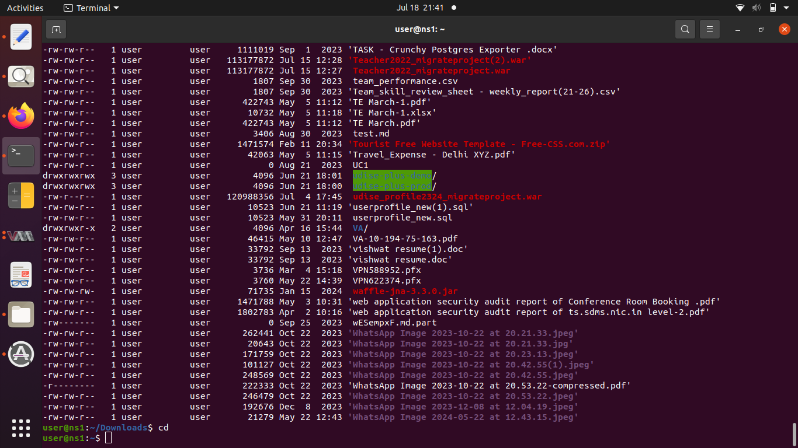

## LDAP (Lightweight Directory Access Protocol) is commonly used on servers for centralized management of user authentication and authorization, as well as for storing and organizing directory information. Here are some of the key reasons why LDAP is used on servers:

1. **Centralized Authentication and Authorization:**
   LDAP provides a centralized way to manage user authentication and authorization across multiple applications and services. Instead of maintaining separate user accounts for each application, you can use LDAP to authenticate users against a single directory, making it easier to manage user access and credentials.

2. **Single Sign-On (SSO):**
   With LDAP, users can have a single set of credentials that they use to log in to various services and applications. This enhances the user experience by reducing the need to remember multiple passwords.

3. **Directory Information Storage:**
   LDAP is designed for storing directory information, which can include user profiles, contact details, organizational structures, and more. This information can be organized hierarchically using Distinguished Names (DNs) and attributes, making it easier to find and retrieve specific data.

4. **Efficient Data Retrieval:**
   LDAP provides a structured and efficient way to retrieve data from the directory. Searches can be performed based on attributes, enabling quick and precise retrieval of information.

#[image](manoj.jpeg)

